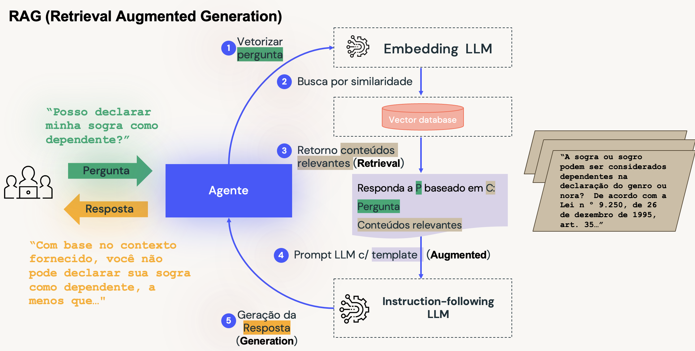

# Implante Seus Chatbots LLM Com a Data Intelligence Platform e o modelo de sua preferência

Neste tutorial, você aprenderá como construir seu próprio Assistente de Chatbot para ajudar seus clientes a responder perguntas sobre o Imposto de Renda, usando Retrieval Augmented Generation (RAG), o modelo de sua preferência e o Vector Search da Databricks.

### Como executar a demo
1. Dentro do diretório **_setup**, acesse o notebook **env** e preencha as variáveis a seguir:
  - catalogo = Nome do catálogo onde você tem acesso de criação de schema
  - prefix_db = Pode manter como está, mas caso queira mudar, esse será o prefixo do seu schema
  - vs_endpoint = Preencha com o nome do endpoint do Vector Search
  - vs_indice = Preencha com o nome do indice do Vector Search
  - instruct_model= Preencher com o nome do endpoint do LLM Instruct que irá usar
  - embedding_model= Preencher com o nome do endpoint do LLM de embbeding que irá usar
  - model_name= Preencha com o nome do seu agente final que será registrado no Unity Catalog

2. Após preencher essas variáveis, executar os notebooks abaixo:
- 01.Rag Chatbot IR - VS
- 02.RAG Chatbot IR with Agent

